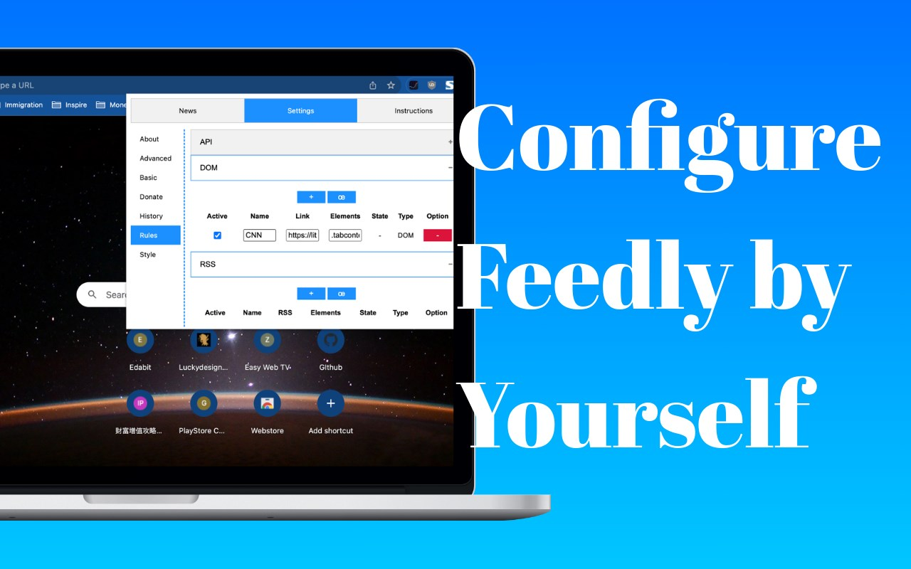
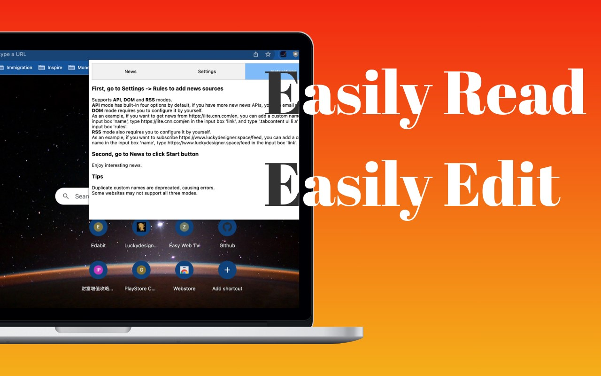

# LuckyNews Box

LuckyNews Box is a browser extension helps you get news quickly, supports API, DOM and RSS, all configured by yourself.

### Features
LuckyNews Box is a powerful browser extension designed to enhance your news consumption experience. Here are some additional details:
- Unlimited News Sources: With support for API, DOM, and RSS feeds, you can configure your own sources and receive news updates without any restrictions. Stay informed on diverse topics of your choice.

- Customizable Style: Tailor the extension to your preferences with customizable options such as font size, font color, and total number of news items displayed. Personalize the appearance to suit your reading comfort.

- Search and Export: Easily search through the news list to find specific articles of interest. You can also export all news items for offline access or reference.

- Import and Export News Rules: Take advantage of JSON file support to import and export your customized news rules. This feature allows for seamless transition and sharing of your personalized news configurations.

- Multilingual Support: LuckyNews Box currently supports English, Japanese, Simplified Chinese, and Traditional Chinese. In future updates, additional languages will be added to cater to a wider user base.

### Installation
To install LuckyNews Box, follow these steps:
1. Download the extension package from the GitHub repository.
2. Open your browser's extension manager (e.g., Chrome Extensions).
3. Go to the "Add-ons" or "Extensions" page.
4. Click on the "Extensions Manager" button.

OR

- [Chrome Extensions](https://chromewebstore.google.com/detail/luckynews-box/addpbaepoebfhkbfjkgdjgaclkimmofg)
- [Firefox Add-ons](https://addons.mozilla.org/en-US/firefox/addon/luckynews-box/)
- [Edge Extensions](https://microsoftedge.microsoft.com/addons/detail/luckynews-box/jlgacmokfocojbpegjhlkknbdoeonnng)

### Usage
1. go to Settings -> Rules to add news sources
- Supports API, DOM and RSS modes.
    - API mode has built-in four options by default, if you have more new news APIs, you can email me.
    - DOM mode requires you to configure it by yourself.
        - As an example, if you want to get news from https://lite.cnn.com/en, you can add a custom name in the input box 'Name', type https://lite.cnn.com/en in the input box 'Link', and type '.tabcontent ul li a' in the input box 'Elements'.
    - RSS mode also requires you to configure it by yourself.
        - As an example, if you want to subscribe https://www.luckydesigner.space/feed, you can add a custom name in the input box 'Name', type https://www.luckydesigner.space/feed in the input box 'RSS'.
2. go to News to click Start button
    - Enjoy interesting news.

3. Tips
    - Duplicate custom names are deprecated, causing errors.
    - Some websites may not support all three modes.